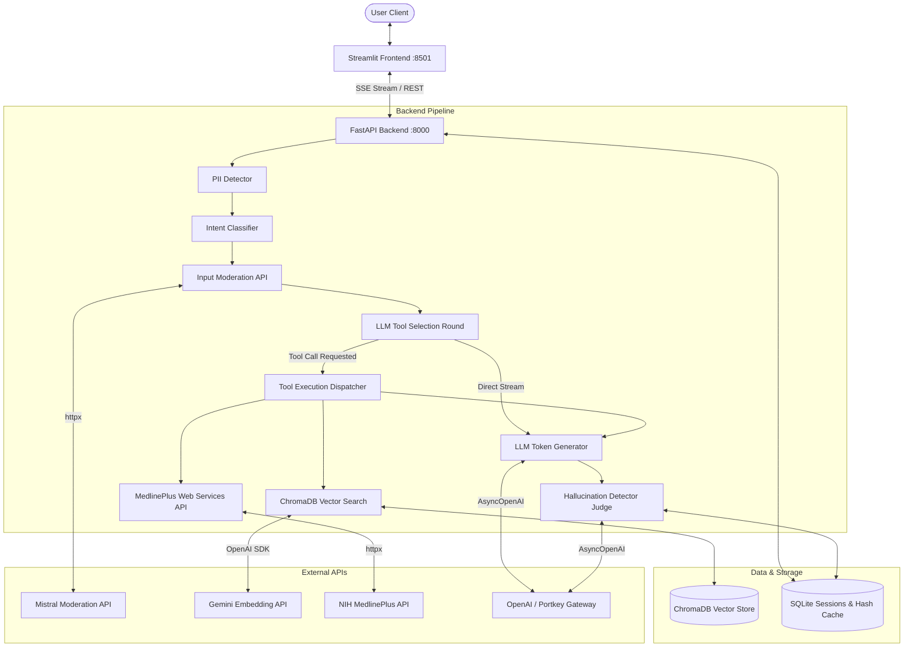
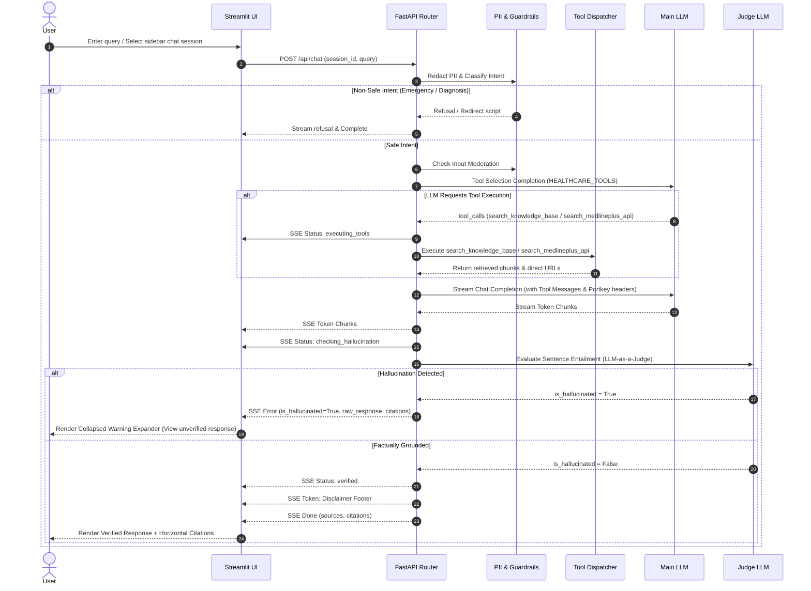

# System Architecture — Healthcare AI Chatbot

## Overview
The Healthcare AI Chatbot is built using a decoupled FastAPI backend microservice and a Streamlit interactive frontend, containerized via Docker Compose.

---

## Tech Stack Rationale

| Component | Technology | Rationale |
|---|---|---|
| **Backend Framework** | FastAPI (Python 3.12) | Asynchronous non-blocking architecture, native SSE streaming support, Pydantic validation. |
| **Frontend UI** | Streamlit | Lightweight, interactive Python UI with real-time SSE streaming, dark theme, and compact session history sidebar. |
| **Tool Architecture** | OpenAI Function Calling | Selective tool invocation (`search_knowledge_base` and `search_medlineplus_api`) preventing prompt context bloat and speeding up TTFT. |
| **Vector Store** | ChromaDB | Lightweight, persistent vector database supporting Gemini Embeddings in cosine distance space over granular ~300-char passages. |
| **Live Health API** | MedlinePlus Web Services API | Official NIH / NLM web service (`https://wsearch.nlm.nih.gov/ws/query`) providing live topic summaries and clickable government URLs. |
| **Database** | SQLite (`aiosqlite`) | Zero-config persistent store for session history, titles, soft-archiving (`is_archived = 1`), and SHA-256 RAG hash caching. |
| **Containerization** | Docker Compose | Two-service orchestration (`backend` + `frontend`) with readiness healthcheck gating. |

---

## Data Flow Diagram

