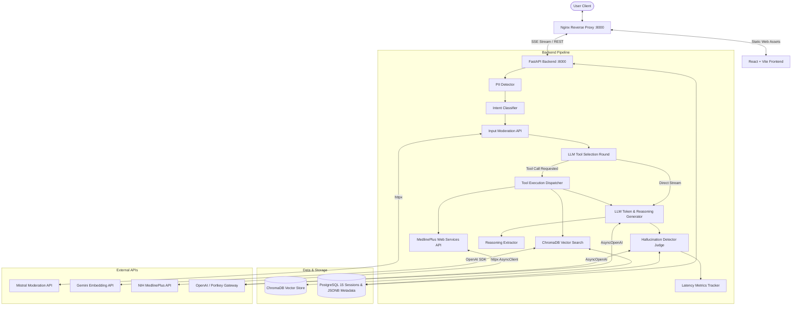

# System Architecture — Healthcare AI Chatbot

## Overview
The Healthcare AI Chatbot is built using a decoupled FastAPI backend microservice, a modern React (Vite + TypeScript) frontend served via an Nginx reverse proxy, and a PostgreSQL 15 relational database, containerized via Docker Compose.

---

## Tech Stack Rationale

| Component | Technology | Rationale |
|---|---|---|
| **Backend Framework** | FastAPI (Python 3.12) | Asynchronous non-blocking architecture, native SSE streaming support, Pydantic validation. |
| **Frontend UI** | React 18 (Vite + TypeScript) | High-performance SPA with real-time SSE streaming, collapsible thinking badge, dynamic session sidebar, dark theme glassmorphism. |
| **Reverse Proxy** | Nginx (Alpine) | Handles single-port routing (:8000), static file serving, and reverse proxying to backend FastAPI service. |
| **Database** | PostgreSQL 15 | Persistent session management, connection pooling via `asyncpg`, native `JSONB` storage for citations, status logs, and timing metrics. |
| **Tool Architecture** | OpenAI Function Calling | Selective tool invocation (`search_knowledge_base` and `search_medlineplus_api`) preventing prompt context bloat and speeding up TTFT. |
| **Vector Database** | ChromaDB | Local embedding vector store providing cosine similarity search over granular knowledge passages. |
| **Observability** | Portkey AI Gateway | Header metadata injection (`x-portkey-metadata`) for full trace logging and user session analytics. |
