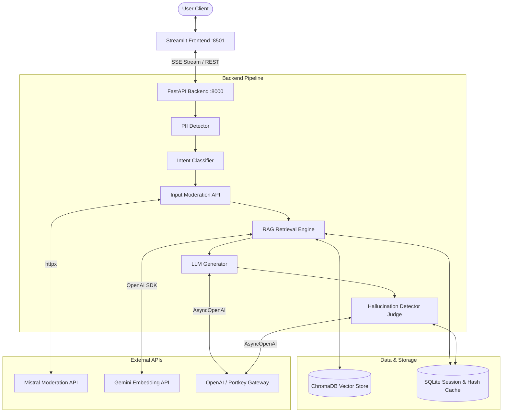
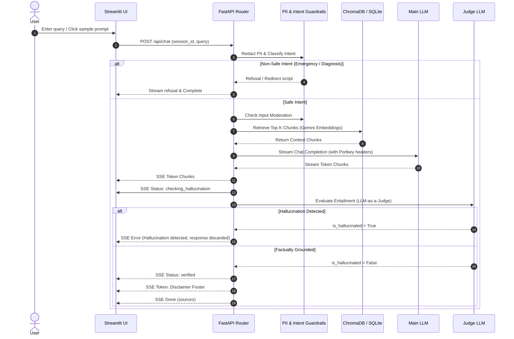

# System Architecture — Healthcare AI Chatbot

## Overview
The Healthcare AI Chatbot is built using a decoupled FastAPI backend microservice and a Streamlit interactive frontend, containerized via Docker Compose.

---

## Tech Stack Rationale

| Component | Technology | Rationale |
|---|---|---|
| **Backend Framework** | FastAPI (Python 3.12) | Asynchronous non-blocking architecture, native SSE streaming support, Pydantic validation. |
| **Frontend UI** | Streamlit | Lightweight, interactive Python UI with real-time SSE streaming and status widgets. |
| **Vector Store** | ChromaDB | Lightweight, persistent vector database supporting custom embedding functions. |
| **Embeddings** | Gemini Embeddings (`gemini-embedding-2-preview`) | High accuracy semantic representation via Google AI Studio OpenAI-compatible API. |
| **Database** | SQLite (`aiosqlite`) | Zero-config persistent store for session turn history and SHA-256 RAG ingestion hash caching. |
| **Containerization** | Docker Compose | Two-service orchestration (`backend` + `frontend`) with readiness healthcheck gating. |

---

## Data Flow Diagram

