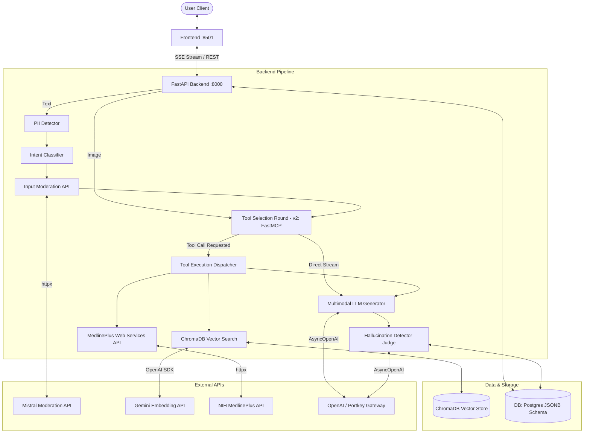
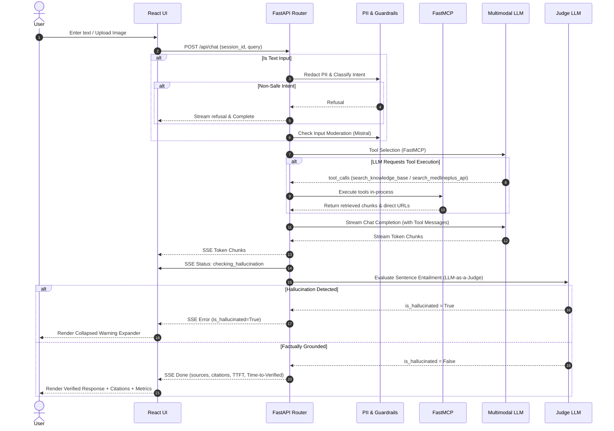
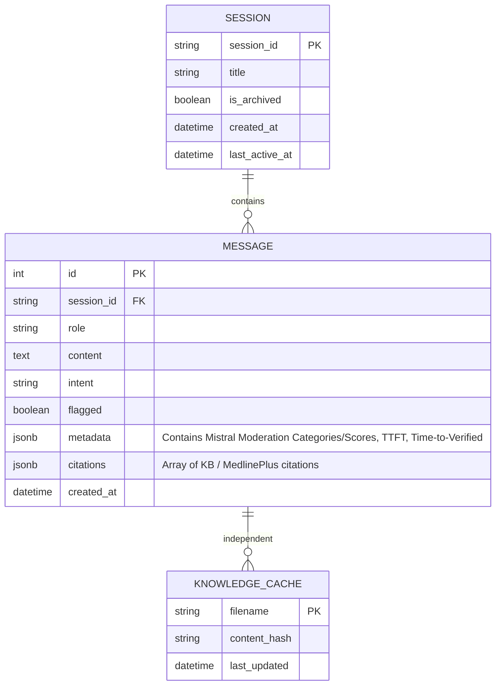

# Healthcare AI Chatbot — Build Spec

**Author:** Harsh Luha
**Audience:** Harsh + coding agents building this project
**Reference Brief:** Healthcare AI Chatbot Development
**Date:** August 1, 2026
**Version:** 4.1 (Updated to match final v2 Implementation Plan)
**Status:** v1 Completed / v2 In Progress

---

## Table of Contents

1. [Purpose and Audience](#1-purpose-and-audience)
2. [Problem Statement](#2-problem-statement)
3. [Goals and Non-Goals](#3-goals-and-non-goals)
4. [Versioning Strategy: v1 and v2](#4-versioning-strategy-v1-and-v2)
5. [Assumptions](#5-assumptions)
6. [Scope](#6-scope)
7. [User Stories](#7-user-stories)
8. [Functional Requirements](#8-functional-requirements)
9. [Non-Functional Requirements](#9-non-functional-requirements)
10. [Tech Stack and Rationale](#10-tech-stack-and-rationale)
11. [System Architecture](#11-system-architecture)
12. [Query Processing Flow](#12-query-processing-flow)
13. [Safety and Guardrail Design](#13-safety-and-guardrail-design)
14. [Knowledge Base and RAG Design](#14-knowledge-base-and-rag-design)
15. [Conversation Memory and Orchestration](#15-conversation-memory-and-orchestration)
16. [Data Model](#16-data-model)
17. [API Design](#17-api-design)
18. [Prompt Engineering Strategy](#18-prompt-engineering-strategy)
19. [UI/UX Design](#19-uiux-design)
20. [Observability and Testing](#20-observability-and-testing)
21. [Deployment and Reproducibility](#21-deployment-and-reproducibility)
22. [Evaluation Criteria Mapping](#22-evaluation-criteria-mapping)
23. [Risks and Mitigations](#23-risks-and-mitigations)

---

## 1. Purpose and Audience

This is a build spec written for Harsh and for coding agents implementing this personal project.

---

## 2. Problem Statement

General health information is scattered across sources of inconsistent quality, and a search page doesn't adapt to a follow-up question the way a conversation can. At the same time, an AI system giving health-adjacent answers carries real risk if it's treated as diagnostic rather than informational.

This project requires a chatbot that closes the first gap without opening the second. That tension drives most of the design decisions below: be genuinely useful inside a narrow, well-defined scope, and be unambiguous about everything outside it.

---

## 3. Goals and Non-Goals

**Goals**

- Answer all six required categories of general health question in a clear, conversational way.
- Make refusal and disclaimer behavior consistent and hard to bypass — enforced in code, not just suggested in a prompt.
- Ground answers in retrieved source content rather than the model's unaided memory.
- Implement intelligent Tool-Calling to pull from both local embeddings and live authoritative health APIs (MedlinePlus).
- Transition from a solid MVP (v1) to a robust, polished production-grade system (v2) with custom React UI, persistent PostgreSQL database, and native multimodal vision capabilities.

**Non-Goals**

- Diagnosing any individual's condition.
- Prescribing or adjusting medication.
- Replacing a licensed medical professional.
- Handling real-time medical emergencies conversationally.
- *Explicitly excluded from roadmap:* Voice integration (STT/TTS) and GraphRAG (sticking with ChromaDB + Gemini for performance).
- *Explicitly excluded from roadmap:* Bidirectional database sync (sticking to standard Postgres) and duckduckgo/web fetch tools (sticking to trusted medical sources).

---

## 4. Versioning Strategy: v1 and v2

Built in two layers: v1 MVP and v2 Enhanced.

**v1 — MVP (Completed)**

- Initial proof of concept.
- Framework-light: plain Python router, SQLite database, Streamlit UI.
- No vendor-specific configuration baked into the code.

**v2 — Local / Showcase Only (In Progress)**

- Never pushed to the shared repository.
- **Orchestration:** Upgraded to **FastMCP** tool-calling orchestration running **in-process (stdio/library)** to guarantee near-zero overhead.
- **Database:** Upgraded to **PostgreSQL** deployed locally via `docker-compose`. Uses `asyncpg` with a startup connection pool (no connect-per-call).
- **Frontend:** Upgraded to a custom **React application** supporting direct image uploads. Designed using the **Stitch MCP** server (`/anti-ui-slop` workflow).
- **Vision:** Direct image upload to the default multimodal LLM. No separate OCR model.

Every section below tags which version a design decision belongs to.

---

## 5. Assumptions

- No user authentication in v1. v2 introduces persistent Postgres, opening the door for multi-session/user account mapping.
- English-language support only.
- Knowledge base is a curated set built from public sources (WHO/MedlinePlus), supplemented by a live integration with the MedlinePlus API.
- LLM access relies on OpenAI-compatible endpoints configured via the environment.
- Deployment target is local Docker.

---

## 6. Scope

### In Scope

| Category | Example |
|---|---|
| Common symptoms | "What are typical symptoms of seasonal flu?" |
| General diseases | "What causes type 2 diabetes?" |
| Healthy lifestyle | "How much sleep do adults generally need?" |
| Nutrition and diet | "What does a balanced plate look like?" |
| Preventive healthcare | "How often should adults get a general check-up?" |
| First-aid guidance | "What do I do for a minor kitchen burn?" |
| **(v2) Vision Input** | *User uploads image of a nutrition label:* "Is this high in sodium?" |

### Explicitly Out of Scope

- **Diagnosis** — "What disease do I have," "Am I having a heart attack."
- **Personal result interpretation** — lab values, imaging, prescriptions.
- **Medication or dosage guidance** — specific drugs, dosing, regimen changes.
- **Real emergencies** — redirected immediately to emergency services, not managed in chat.

Every in-scope response carries a disclaimer. Every out-of-scope attempt gets a clear explanation of why, plus a pointer to the right kind of help.

---

## 7. User Stories

- As a health-curious user, I want to ask about common symptoms, so I can understand what I might be dealing with before deciding whether to see a doctor.
- As a user planning meals, I want general nutrition guidance, so I can make healthier daily choices.
- As a caregiver, I want first-aid steps for minor injuries, so I can respond calmly and correctly in the moment.
- As any user, I want to easily revisit and continue my previous health chats via a simple sidebar interface.
- **(v2) As a user with physical health materials, I want to upload pictures of pamphlets or nutrition labels so the AI can analyze them directly.**
- **(v2) As a user, I want to be able to cancel an ongoing generating response to save time, and edit my past messages to correct typos.**

---

## 8. Functional Requirements

| ID | Requirement | Priority | Version |
|---|---|---|---|
| FR-01 | Accept free-text healthcare questions through a chat interface | Must | v1 |
| FR-02 | Answer general questions across the six required health categories | Must | v1 |
| FR-03 | Attach an appropriate medical disclaimer to health-related responses | Must | v1 |
| FR-04 | Detect and refuse diagnosis or prescription requests, redirecting to a professional | Must | v1 |
| FR-05 | Detect emergency language and redirect to emergency services instantly | Must | v1 |
| FR-06 | Call a `/moderations` endpoint on text input, ignoring Health/PII category flags | Must | v1 |
| FR-07 | Utilize OpenAI Tool-Calling (Function Calling) to selectively execute queries | Must | v1 |
| FR-08 | Query local ChromaDB for RAG context via `search_knowledge_base` | Must | v1 |
| FR-09 | Query live MedlinePlus Web Services API via `search_medlineplus_api` | Must | v1 |
| FR-10 | Evaluate generated responses for hallucination (LLM-as-a-judge) | Must | v1 |
| FR-11 | Stream responses token-by-token using SSE | Must | v1 |
| FR-12 | Maintain conversational context across turns within a session (Max 6 turns) | Must | v1 |
| FR-13 | Display multi-session sidebar navigation with auto-titling and soft-archiving | Must | v1 |
| FR-14 | Present unverified/hallucinated responses in a collapsed warning UI | Must | v1 |
| FR-15 | Show which knowledge base sources/URLs informed a response with exact excerpts | Must | v1 |
| FR-16 | Use **FastMCP** (in-process/stdio) for tool-calling orchestration | Must | v2 |
| FR-17 | Deploy a custom **React application** (replacing Streamlit) using Stitch MCP | Must | v2 |
| FR-18 | Support image uploads passed directly to multimodal LLMs (No OCR step, bypasses PII/Mod) | Must | v2 |
| FR-19 | Use **PostgreSQL** (`asyncpg` + pooling) with JSONB tracking for metrics/moderation | Must | v2 |
| FR-20 | Support Message Editing (full re-run of guardrails, atomic DB transaction) | Must | v2 |
| FR-21 | Support Request Cancellation (explicit backend `asyncio` task abort on disconnect) | Must | v2 |

---

## 9. Non-Functional Requirements

| Category | Requirement |
|---|---|
| Performance | Fast TTFT via selective tool invocation and FastMCP in-process routing. |
| Privacy | No raw PII persisted in logs or the session store; redacted via regex before storage. Images are never persisted. |
| Configurability | LLM endpoints (main, judge, embedding) and moderation keys read from `.env` |
| Portability | Full stack starts with a single `docker compose up --build -d` |
| Observability | Native Portkey header injection (`x-portkey-metadata`) grouping traces by session ID |
| Resiliency (v2) | External API calls (Moderation, Judge, Vision) implement a strict bounded retry budget (e.g. max 2 retries, 1s total) and **fail-closed** gracefully rather than hanging indefinitely. |

---

## 10. Tech Stack and Rationale

| Component | v1 (Submission) | v2 (Enhanced) | Rationale |
|---|---|---|---|
| **Backend** | FastAPI | Same | Asynchronous non-blocking architecture, native SSE. |
| **Frontend UI** | Streamlit | Custom React App | React provides better interactivity for uploads, editing, cancelling, and metric displays. |
| **Orchestration** | Plain Python Router | FastMCP | Explicit orchestration with near-zero dependency overhead via stdio/in-process execution. |
| **Vector Store** | ChromaDB | Same | Chosen over GraphRAG/Neo4j for pure speed, latency, and avoidance of LLM Cypher-generation failure modes. |
| **Embeddings** | Gemini | Same | `gemini-embedding-2-preview` |
| **Live API** | MedlinePlus API | Same | Official NIH web service for verified topic summaries. |
| **Database** | SQLite (`aiosqlite`) | PostgreSQL | Migrating to Postgres via `docker-compose` using `asyncpg` (with connection pooling) allows JSONB tracking of citations and moderation metadata. |
| **Observability** | Portkey | Same | Injects `user=session_id` to trace LLM calls. |
| **Vision Model** | N/A | Default Multimodal LLM | The default text models are already vision-capable. No separate OCR model required. |

---

## 11. System Architecture

---

## 12. Query Processing Flow

*(FastMCP handles the Tool Selection loop in v2)*

---

## 13. Safety and Guardrail Design

Safety is enforced through multiple distinct, fail-closed layers:

1. **Local PII redaction** — Fast regex scanner strips identifying details before any external API call. *(Applies to text only).*
2. **Local intent classification** — Catches emergency and diagnosis phrasing. Distinguishes between first-person emergencies and third-person educational questions. *(Applies to text only).*
3. **Input moderation** — Async `httpx` POST to a `/moderations` endpoint. Ignores `health` and `pii` categories. Must fail-closed on bounded retry failure. *(Applies to text only).*
4. **Hallucination Detector (LLM-as-a-Judge)** — NLI entailment evaluation checking sentence factual support against retrieved tool snippets before UI rendering. Flagged responses are collapsed, not deleted, with a strict warning. Must enforce JSON-object mode and fail-closed on bounded retry failure.
5. **Disclaimer enforcement** — Disclaimer footer is appended natively in the backend stream.
6. **(v2) Vision Pipeline** — Users can upload up to 5 images per message. Because these images bypass PII/Moderation (no OCR pre-extraction), the raw images are never persisted to the database or storage. They are sent directly to the LLM. 
7. **(v2) Cancellation Abort** — The "Cancel" button detects client SSE disconnects and propagates an `asyncio` task cancellation to the backend to immediately halt LLM compute.
8. **(v2) Message Editing** — Edits trigger a completely fresh run of the guardrail pipeline (PII/Intent/Moderation). The database update (delete subsequent + insert new) runs inside a single, atomic Postgres transaction.

---

## 14. Knowledge Base and RAG Design

- **Local Sources:** Markdown fact sheets parsed into granular passages.
- **Embeddings:** `gemini-embedding-2-preview` indexed in ChromaDB using cosine distance. (Preferred over GraphRAG to minimize latency).
- **RAG Configuration:** Follows `RAG_SIMILARITY_THRESHOLD` and `RAG_TOP_K` from config. Low confidence scores trigger a caveated response.
- **Live Search Tool:** `search_medlineplus_api` executes live XML fetches against `wsearch.nlm.nih.gov`.

---

## 15. Conversation Memory and Orchestration

- **Lazy Session Creation**: Row is explicitly created prior to auto-titling to fix visibility race conditions.
- **Auto-Titling**: Router parses the first turn to auto-generate a topic-specific title for the sidebar.
- **Soft Archiving**: Deleting a chat sets `is_archived = 1`.

---

## 16. Data Model (Postgres JSONB)

In v2, the `MESSAGE` table utilizes `JSONB` columns to persist citations and guardrail metrics across session reloads.

---

## 17. API Design

| Method | Endpoint | Description |
|---|---|---|
| GET | `/health` | Liveness/readiness container healthcheck. |
| GET | `/api/sessions` | List active chat sessions. |
| POST | `/api/session` | Create a new chat session record. |
| PATCH | `/api/session/{session_id}` | Rename or update session title. |
| DELETE | `/api/session/{session_id}` | Soft-delete / archive a session. |
| GET | `/api/session/{session_id}/history` | Fetch complete message history array for session. |
| POST | `/api/chat` | Submit chat query (or image context in v2) and receive SSE event stream. Supports client disconnects. |
| PUT | `/api/chat/{message_id}` | (v2) Edit an existing message (atomic history overwrite). |

---

## 18. Prompt Engineering Strategy

- **System prompt** defines the assistant's role, supported tools, and response boundaries.
- **Tool-Calling Schemas** strictly define the parameters for `search_knowledge_base` and `search_medlineplus_api` (wrapped via FastMCP in v2).

---

## 19. UI/UX Design

**v2 Feature Parity Requirements for Custom React App:**
- **Image Uploads & Persistence:** Users can attach up to 5 images to a single message. Because images are not persisted to the database for privacy reasons, they are held in browser memory during the live session. On page reload, the UI must render a placeholder (e.g., `[Image removed for privacy]`) in place of the past uploads.
- **Sidebar Chat History**: Active conversations listed with full message restore on tap.
- **Input Lock:** The input box must lock out new messages until the previous response is fully received (replaces arbitrary vision rate-limiting).
- **Cancellation & Editing:** Provide a visible "Cancel" button to abort streams, and an "Edit" button for past messages.
- **Hyperlinked Citations:** Source citations dynamically linked (e.g., using GitHub commit-pinned permalinks for KB docs).
- **Hover Quotes:** Exact retrieved knowledge base excerpts/quotes must be visible when hovering over the citation.
- **Collapsed Hallucination UX:** Unverified responses are hidden behind a collapsible warning alert (`View unverified response`).
- **Metric Display:** Display `TTFT` and `Time-to-Verified` in small text beneath each assistant message, parsed from the DB `metadata` JSONB.
- **v2 Constraints:** The coding agent must use **Stitch MCP** with the `/anti-ui-slop` workflow to ensure non-generic, high-quality bespoke React design, including image upload drops zones.

---

## 20. Observability and Testing

- **Portkey Header Injection**: All LLM, embedding, and moderation clients inject `x-portkey-metadata: {"_user": "<session_id>"}` allowing comprehensive trace grouping.
- **Automated Tests**: Appropriately make comprehensive `pytests` that ensure full coverage of the new FastMCP tools, the fixed fail-closed moderation logic, and all inherent guardrail pathways.
- **Cross-Phase Regression Gate**: The full automated guardrail regression suite MUST be re-run and pass at the end of every new implementation phase (DB migration, FastMCP swap, etc.) to ensure rewrites don't swallow safety bugfixes.

---

## 21. Deployment and Reproducibility

- Single `docker compose up --build -d` spins up `frontend`, `backend`, and the `postgres` container.
- Universal `.env` configuration allowing drop-in of OpenAI, Google Gemini, and Portkey Gateway credentials.
- No vendor lock-in baked into code paths.

---

## 23. Risks and Mitigations

| Risk | Mitigation |
|---|---|
| LLM hallucination on medical topics | NLI LLM-as-a-Judge verification + Collapsed warning UX |
| Over-refusal frustrates legitimate users | Deterministic Intent Classifier explicitly distinguishes first-person emergencies |
| API latency from tools | FastMCP in-process dispatch (stdio) |
| Missing DB history on crash during edit | Atomic Postgres transaction for edit-history rewrites |
| Runaway costs on image uploads | UI input lock and backend `asyncio` client disconnect aborts |