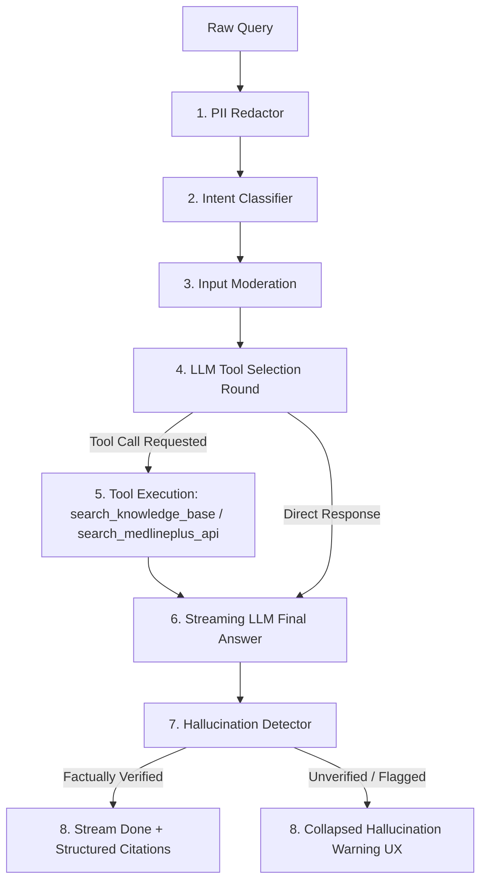

# Query Processing & Safety Logic Documentation

This document explains the end-to-end query processing pipeline, multi-layer guardrail design, tool-calling (function calling) architecture, session management strategy, and security verification approach.

---

## 1. Multi-Layer Guardrail & Tool-Calling Architecture

### Stage 1: PII Redaction (`PIIDetector`)
- **Execution**: Local regex scanner running in `< 1ms`.
- **Patterns**:
  - Email addresses: `\b[A-Za-z0-9._%+-]+@[A-Za-z0-9.-]+\.[A-Z|a-z]{2,}\b`
  - Phone numbers (Indian & International format): `(\+91[\-\s]?)?[6-9]\d{9}`
  - Aadhaar card numbers: `\d{4}[\s\-]?\d{4}[\s\-]?\d{4}`
  - PAN card numbers: `[A-Z]{5}\d{4}[A-Z]`
  - IP addresses: `(?:\d{1,3}\.){3}\d{1,3}`
  - Vehicle numbers: `[A-Z]{2}[\s\-]?\d{2}[\s\-]?[A-Z]{1,2}[\s\-]?\d{4}`
- **Behavior**: Replaces matches with explicit markers (`[EMAIL_REDACTED]`, `[PHONE_REDACTED]`, etc.) before any external API or storage call.

### Stage 2: Intent Classifier (`IntentClassifier`)
- **Execution**: Fast deterministic keyword matching.
- **Categories**:
  - **Emergency**: Triggers immediate redirect to emergency service instructions (911 / 112).
  - **Diagnosis & Prescription**: Triggers structured refusal directing user to a licensed healthcare practitioner.
  - **Safe**: Passes to moderation and processing pipeline.

### Stage 3: Input Moderation (`InputModerator`)
- **Execution**: Async `httpx` POST to external moderation API (`mistral-moderation-latest`).
- **Ignored Categories**: `{"health", "pii"}` (since medical questions naturally discuss body symptoms).
- **Enforced Categories**: `sexual`, `violence_and_threats`, `selfharm`, `hate_and_discrimination`, `dangerous`, `criminal`, `jailbreaking`.
- **Portkey Metadata**: Passes `x-portkey-metadata` header containing `{"_user": "<session_id>"}`.

### Stage 4: OpenAI Tool Selection & Execution (`tools.py`)
Instead of pre-retrieval prompt stuffing, the LLM receives JSON Schema tool specifications:
1. `search_knowledge_base`: Queries ChromaDB vector database over granular ~300-character passages using Gemini Embeddings (`gemini-embedding-2-preview`) in cosine distance space.
2. `search_medlineplus_api`: Queries the official NIH / MedlinePlus Developer Web Services API (`https://wsearch.nlm.nih.gov/ws/query?db=healthTopics&term={term}`) for live health topic summaries and official government URLs.
- **Execution**: If the model decides information is required, it returns `tool_calls`. The backend executes tool calls asynchronously, extracts `CitationItem` objects with exact snippet excerpts and direct URLs, and feeds tool response messages back into context.

### Stage 5: Streaming Response Generation & Disclaimer
- Streams token-by-token text to the client via Server-Sent Events (SSE).
- Direct queries (greetings, emergency refusals) bypass tools entirely for instant (< 1s) responses.

### Stage 6: Hallucination Detector (`HallucinationDetector`) & Collapsed UX
- **Execution**: Async LLM-as-a-Judge NLI entailment evaluation checking sentence factual support against retrieved tool snippets.
- **Collapsed Hallucination Response UX**:
  - If `is_hallucinated == True`, the generated response is **not deleted**.
  - The UI renders a warning banner (`Warning: Potential hallucination or unverified claim detected.`) and wraps the response inside a collapsed container:
    `st.expander("View unverified response (Use with caution)")`
  - Accompanied by advice: *"This response could not be fully verified against official medical knowledge sources. Please consult a licensed healthcare provider."*

---

## 2. Granular Ingestion & Content Caching Logic

To satisfy developer web service guidelines (MedlinePlus / NLM) and optimize retrieval speed:
1. On startup, `rag_manager.ingest_knowledge_files` computes the SHA-256 hash of each file in `backend/knowledge/`.
2. Hashing is checked against the SQLite `knowledge_cache` table.
3. If content hash matches, ingestion skips re-embedding.
4. If changed or new, Markdown files are split into granular ~300-character (~50 word) passages on section (`###`) and bullet boundaries.
5. Passages are embedded via `gemini-embedding-2-preview`, indexed in ChromaDB with heading/snippet metadata, and updated in `knowledge_cache`.

---

## 3. Portkey Observability Integration

Across all backend components:
- `llm_client.py`: Chat completions pass `user=session_id` and header `x-portkey-metadata: {"_user": "<session_id>"}`.
- `guardrails.py`: Moderation and Judge LLM requests include the same metadata headers.
- `rag.py`: Embedding requests include user and metadata headers.

---

## 4. Multi-Session Management & Auditability

To maintain full auditability while providing seamless UI chat session switching:
1. **Lazy Session Creation**:
   - Page load or clicking "+ Start New Chat" generates a client UUID without creating empty records in SQLite.
   - The session row is created automatically on execution of the first message turn.
2. **Auto-Titling & Title Editing**:
   - The query router inspects initial session turns and auto-populates `title` from the query topic string.
   - Users can update session titles via `PATCH /api/session/{session_id}`.
3. **Inner Join Query Filter**:
   - `list_active_sessions` executes an `INNER JOIN` against `messages`, strictly excluding 0-message sessions from the Chat History navigation list.
4. **Soft Deletion / Archiving**:
   - Deleting a chat sets `is_archived = 1` and `archived_at = <ISO_TIMESTAMP>` in SQLite `sessions`, keeping historical turns available for audit against Portkey observability traces.

---

## 5. Security & Red-Team Testing Strategy

The test suite in `backend/tests/test_guardrails.py` uses test payloads adapted from security test suites (`prompt_injection.json`, `jailbreak.json`, `data_exfiltration.json`, `harmful_content.json`).

Tests verify:
- Complete PII pattern redaction.
- Instant emergency and diagnostic refusal.
- System prompt non-leakage under adversarial jailbreak attempts.
- In-scope medical question accuracy without false positive refusals.
